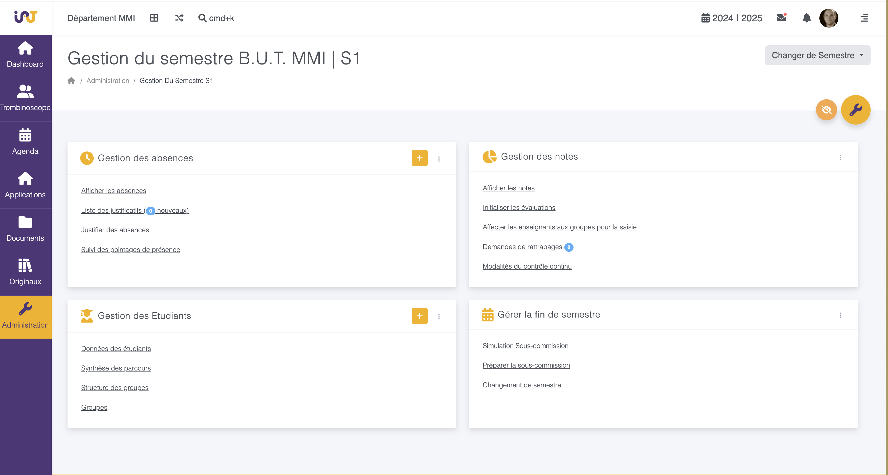
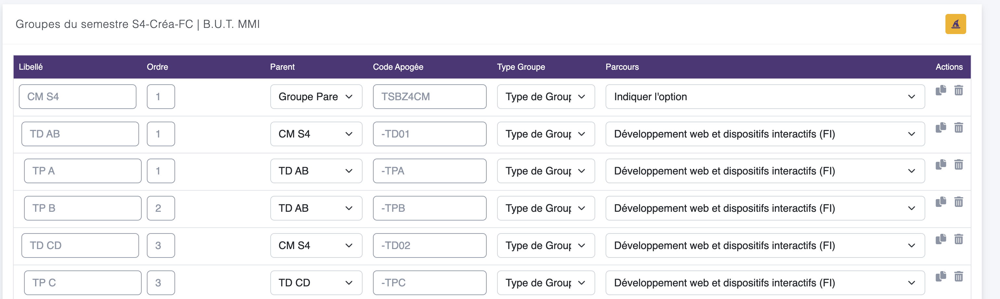

## Gérer les groupes

Dans l'espace Administration, puis le semestre de votre choix vous pouvez accéder à la gestion des groupes en choisissant :

- Structure des groupes : pour construire l'arborescence CM, TD, TP, ... les noms, les codes Apogées, ...
- Groupes : pour gérer l'affectation des étudiants dans des groupes.

### Structure des groupes

La page de gestion de la structure des groupes se découpe en 3 parties.

- Une première partie contenant l'arborescence des groupes, avec un lien hiérarchique entre les éléments. Cette partie est détaillée par la suite.
- Un formulaire pour ajouter un groupe dans la structure
- La partie "type de groupe" qui permet de décrire les "type de groupe", c'est à dire CM, TD, TP, voire des groupes de type LV2 ou autres selon vos besoins.

#### Gérer les groupes

Dans cette première partie de la page, vous pouvez éditer toutes les informations, les modifications sont sauvegardées automatiquement. 

**Le code Apogée du groupe doit être le même que celui de Celcat/Apogée afin que le lien puisse se faire pour l'emploi du temps et l'import des groupes si vous utilisez cette option.**

Détails des colonnes :
- Libellé : Il est libre et sera l'affichage du groupe sur l'intranet. Il peut être différent de Celcat et Apogée et doit être explicite pour les équipes et les étudiants.
- Ordre : Implique l'ordre d'affichage du groupe dans l'emploi du temps.
- Parent : Permet de décrire la hierarchie des groupes, notamment utile pour automatiquement affecter des étudiants depuis un TP vers le TD et le CM.
- Le code Apogée : qui doit correspondre au code saisi dans Apogée/Celcat
- Type de groupe : Permet de définir si c'est du CM, TD, TP, ... Permet de regrouper les groupes dans le trombinoscope.
- Le parcours le cas échéant, pour filtrer la saisie des notes, les étudiants, ... selon les groupes.
